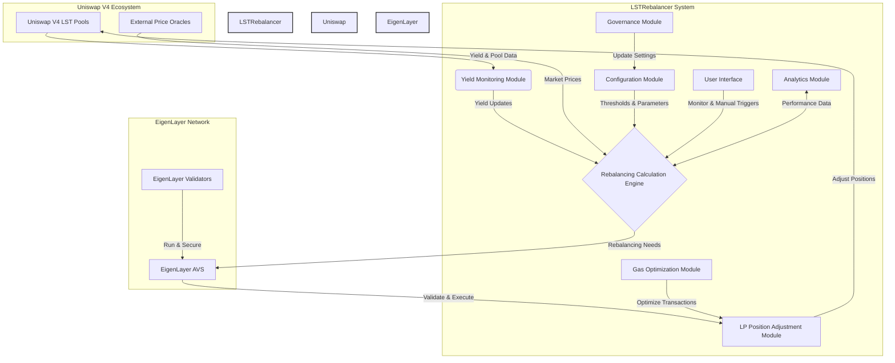
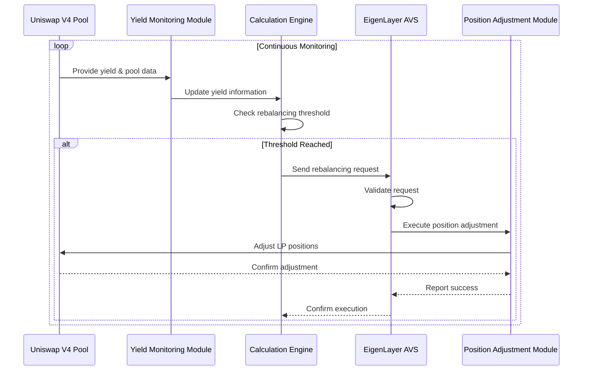

# LSTRebalancer: Automated LP Position Adjustment for LST Pools

## Introduction

LSTRebalancer is a decentralized service built on EigenLayer that automatically adjusts Liquidity Provider (LP) positions for Liquid Staking Token (LST) pools in Uniswap V4. By leveraging EigenLayer's Actively Validated Services (AVS), LSTRebalancer optimizes LP positions to account for the yield-bearing nature of LSTs, reducing slippage and improving overall pool efficiency.

## Problem Statement

In Uniswap pools involving Liquid Staking Tokens (LSTs) like stETH-ETH or rETH-USDC:

1. LPs face extra slippage due to the natural yield-bearing characteristics of LSTs.
2. The yield accrual causes the price ratio in the pool to drift over time, leading to suboptimal liquidity distribution.
3. Manual rebalancing is inefficient, costly, and often overlooked by LPs.

## Our Solution

LSTRebalancer addresses these challenges by:

1. Automatically reading the yield from liquid staking positions.
2. Adjusting all LP positions up the curve by a constant amount to account for accrued yield.
3. Leveraging EigenLayer's AVS for secure, decentralized execution of rebalancing operations.

## How LSTRebalancer Works

1. AVS operators continuously monitor LST yields for supported pools.
2. When yield accrual reaches a predetermined threshold, the rebalancing process is triggered.
3. The system calculates the optimal position adjustment based on accrued yield.
4. EigenLayer AVS validates and executes the rebalancing transaction.
5. LP positions are automatically adjusted, maintaining optimal liquidity distribution.

## Technical Architecture

The following diagram illustrates the key components and interactions of the LSTRebalancer system:



## Sequence Diagram

The following sequence diagram illustrates the flow of operations in LSTRebalancer:



## Key Benefits

1. Reduced Slippage: Maintains optimal liquidity distribution despite LST yield accrual.
2. Improved Capital Efficiency: Ensures LP capital is always optimally positioned.
3. Automated Management: Reduces the need for manual intervention by LPs.
4. Gas Efficiency: Batched rebalancing operations minimize gas costs.
5. Decentralized Security: Leverages EigenLayer's robust security model.

## Use Cases

1. stETH-ETH pools
2. rETH-USDC pools
3. Other LST-based liquidity pools

## Installation and Setup

[Provide detailed instructions for setting up LSTRebalancer locally, including prerequisites, environment setup, and installation steps]

## Usage Guide

[Explain how to integrate LSTRebalancer with Uniswap V4 pools, configure yield thresholds, and monitor rebalancing operations]

## Future Roadmap

1. Support for additional LST tokens and pools
2. Advanced yield prediction algorithms
3. Integration with other DEXs beyond Uniswap
4. User interface for LP position monitoring and manual triggers
5. Cross-chain LST pool rebalancing

## Contributing

We welcome contributions to LSTRebalancer! Please see our [CONTRIBUTING.md](CONTRIBUTING.md) file for details on how to get involved.

## License

This project is licensed under the [MIT License](LICENSE).

## Setting up

#### Testing

Build all contracts
```
forge build
```

Test all project
```
make test_all
```
